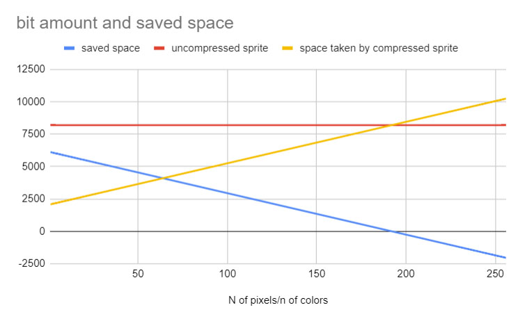

# Arduino_based_24-bit_16x16_pixel_compressor

 The idea is to make LED matrix images smaller. To show with FastLed libary with ws2812 addressable leds(or similar). The compression is based on two scripts. First is the compressor and the second is the code to show the image. The compressort lists different colors and the places for corresponding colors.  Then to draw the image, the pixel number and the color is given to the output.

THe compressor script gives copy-paste ready text to the serial monitor. This test is the frames .h file excluding the last line of the output. 

In the main code the pixel data are stored in .h files. where from the LedOn function will display the image. 
The compressor script gives ready made function for the given frame ( LedON(NameColrsNum, NameNumOfDiffCol, NameColrs, Namepointers); ect.) This line needs to be cut from the .h file and pasted into the main code.  

The .h files needs to be #Included to the main code in order those to work. 

# Some calculations for the saved space:

Let's say the number of pixels will be 256. Normally the image would be  storred in 32bit array, where every pixel color would be stored separetly. This would take 256* 32bits(because there is no uint24_t in arduino) =  ‭8 192‬ bits of space.  
 
 In this compression the places of the pixrels will take base space, because every pixel place is needed.Pixel colors will be saved in a byte. That will take 256 * 8 bits = 2048 bits.
Every different color takes 32 bits That means that the only space adding thing is the number of colors used.  That means unicolor image will take 32 bits more space on the top of the 2048 bits. Five color image would take 5*32 bits= 160 bits  more on the top of the base 2048 bits.  The overall space  used: 256 * 8 +(N * 32), N = number of different colors. This means that after 192 different colors this method takes more space than just storing the sprite as is. But there might not be many sprites with that many different colors.

 
  
  The saved space is from 6112 bits(for single color) to 0 in increments of 32 bits until 192 colors. After 192 colors this method takes more space than the 32 bit sprite in array itself. 
  
  
The code haven't been tested on very large number of colors. So the speed with large number of images is unknown. 
Tested on Atmega32U4. May work on other devices also. 

Disclaimer: This is my "Human malvare" coding learning experiense. 

# To-Do
Examples more clear.
Mabye make the colors 32-bit hex file into two dimenensional array. where the color information is stored in 3x8 bit values. This could save one byte per color. 24bits vs 32 bits. Then parse the needed hex format in runtime for the FastLed.
